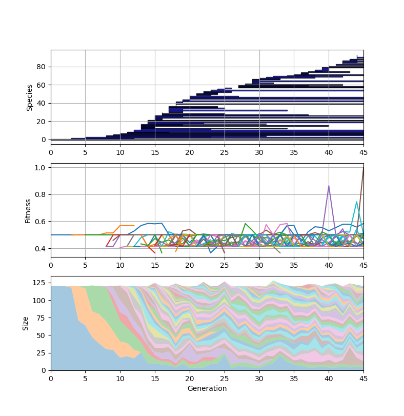

# NEAT implementation in Python

This repository contains an implementation of [NeuroEvolution of Augmenting Topologies](http://nn.cs.utexas.edu/downloads/papers/stanley.ec02.pdf) (NEAT) as it was described by Ken Stanley in 2002.

For short, NEAT is an evolutionary algorithm that evolves the parameters and the topology of an artifical neural network. It typically requires the definition of a task specific performence measure (the fitness function) that needs to be evaluated by simulating the beahviour of each individual. Therefore, NEAT works fine for small networks and tasks with manageable simulation effort.

The following tasks are currently implemented:

- XOR, it requires at least one hidden unit and is therefore ideal for testing the implementation
- Inverted pendulum, a pole is balanced by controlling a cart
- Car on a racetrack, the model for the vehicle dynamics is rather sophisticated and it seams that NEAT struggles with speed changes and gear shift

Here are some nice plots of the XOR evolution:

It takes an average of 14 generations to solve the XOR task. Later, I noticed that [peas](https://github.com/noio/peas) does it with fewer generations. So, if you find out why this is the case, please let me know... ;)
